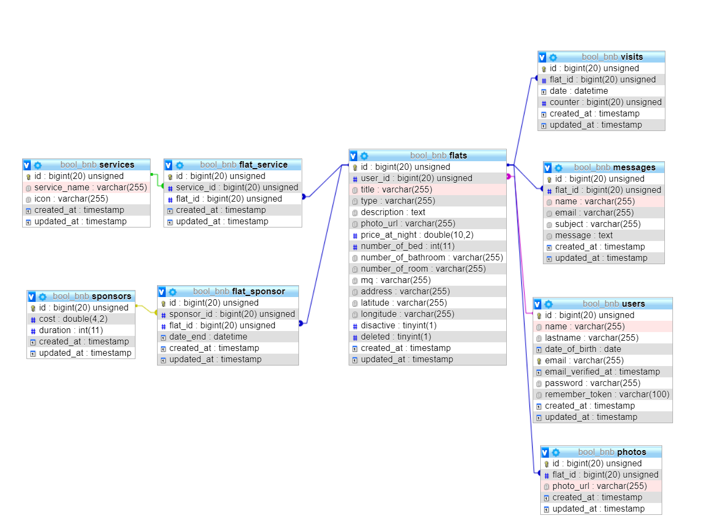

#   AIRBNBFINAL

> 

>

> ##### *:open_file_folder:   AirBnbFinal- Una mia riproduzione del famoso AirBnb  :open_file_folder:*

>

> 

---

****Introduzione:**** 

Un applicazione per trovare e gestire l’affitto di appartamenti, attraverso filtri su servizi, posizione geografica o specifiche preferenze.

---

### :spiral_notepad: **Anterprima**

Il database del progetto:

### :arrow_forward: Anteprima Pagine Web:
>  Preview Desktop :desktop_computer: 

### :arrow_forward: Anteprima Pagine Mobile:
>  Preview Mobile :iphone: 

### :computer: Linguaggi e Tecnologie utilizzate:

* HTML

* CSS

* SASS

* Bootstrap

* JS

* jQuery

* Chart Js

* Algolia (Places/Scout/Autocomplete/Instasearch Js)

* Braintree

* Ajax

* MySql

* PHP

* Laravel

* Carbon